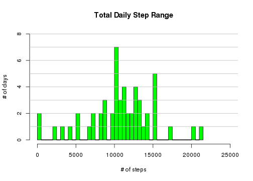
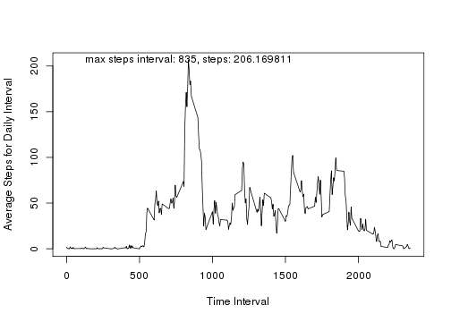
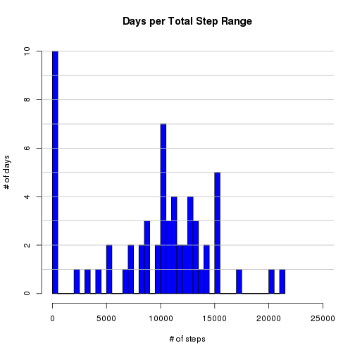
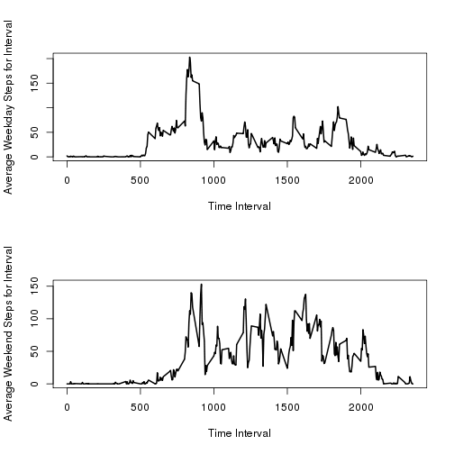

## $Id: PA1_template.Rmd,v 1.1 2015/04/19 15:57:36 richard Exp richard $

---
title: "Reproducible Research: Peer Assessment 1"
output: 
  html_document:
    keep_md: true
---

## Loading and preprocessing the data


```r
hostname <- "https://d396qusza40orc.cloudfront.net"
filename <- "repdata%2Fdata%2Factivity.zip"
savename <- "activity.zip"
membname <- "activity.csv"
fullname <- sprintf("%s/%s",
                    hostname,
                    filename)
download.file(fullname,
              savename,
              "wget")
fidgety.feet <- read.table(unz(savename,
                               membname),
                           header=TRUE,
                           stringsAsFactors=FALSE,
                           sep=",")
print(sprintf("### loaded %d rows from %s",
              nrow(fidgety.feet),
              membname))
```

```
## [1] "### loaded 17568 rows from activity.csv"
```

## What is mean total number of steps taken per day?


```r
fidgety.feet <- na.omit(fidgety.feet)
daily.steps  <- rowsum(fidgety.feet$steps,
                      fidgety.feet$date,
                      na.rm=TRUE)
print("### Total Steps per Day")
```

```
## [1] "### Total Steps per Day"
```

```r
print(daily.steps)
```

```
##             [,1]
## 2012-10-02   126
## 2012-10-03 11352
## 2012-10-04 12116
## 2012-10-05 13294
## 2012-10-06 15420
## 2012-10-07 11015
## 2012-10-09 12811
## 2012-10-10  9900
## 2012-10-11 10304
## 2012-10-12 17382
## 2012-10-13 12426
## 2012-10-14 15098
## 2012-10-15 10139
## 2012-10-16 15084
## 2012-10-17 13452
## 2012-10-18 10056
## 2012-10-19 11829
## 2012-10-20 10395
## 2012-10-21  8821
## 2012-10-22 13460
## 2012-10-23  8918
## 2012-10-24  8355
## 2012-10-25  2492
## 2012-10-26  6778
## 2012-10-27 10119
## 2012-10-28 11458
## 2012-10-29  5018
## 2012-10-30  9819
## 2012-10-31 15414
## 2012-11-02 10600
## 2012-11-03 10571
## 2012-11-05 10439
## 2012-11-06  8334
## 2012-11-07 12883
## 2012-11-08  3219
## 2012-11-11 12608
## 2012-11-12 10765
## 2012-11-13  7336
## 2012-11-15    41
## 2012-11-16  5441
## 2012-11-17 14339
## 2012-11-18 15110
## 2012-11-19  8841
## 2012-11-20  4472
## 2012-11-21 12787
## 2012-11-22 20427
## 2012-11-23 21194
## 2012-11-24 14478
## 2012-11-25 11834
## 2012-11-26 11162
## 2012-11-27 13646
## 2012-11-28 10183
## 2012-11-29  7047
```


```r
top.grid <- 8
hist(daily.steps[,1],
     breaks=length(daily.steps[,1]),
     main="Total Daily Step Range",
     xlab="# of steps",
     ylab="# of days",
     xlim=c(0,25000),
     ylim=c(0,top.grid),
     col="green",
     plot=TRUE)
for(n in 1:top.grid)
    abline(h=n, col="grey")
```

 


```r
fidgeting.feet <- na.omit(fidgety.feet)
fidgety.steps<- rowsum(fidgeting.feet$steps,
                       fidgeting.feet$date)
fidgety.mean   <- mean(fidgety.steps)
fidgety.median <- median(fidgety.steps)
print(sprintf("### mean   steps per day = %f",
              fidgety.mean))
```

```
## [1] "### mean   steps per day = 10766.188679"
```

```r
print(sprintf("### median steps per day = %d",
              fidgety.median))
```

```
## [1] "### median steps per day = 10765"
```

## What is the average daily activity pattern?


```r
perfect.day <- aggregate(fidgety.feet$steps,
                         fidgety.feet["interval"],
                         mean,
                         na.rm=TRUE)
plot(x=perfect.day[ ,1],
     y=perfect.day[ ,2],
     xlab="Time Interval",
     ylab="Average Steps for Daily Interval",
     type="l")

maxintvl <- 1
for(n in 1:nrow(perfect.day))
    if(perfect.day[n,2] > perfect.day[maxintvl,2])
        maxintvl <- n
print(sprintf("maxintvl=%d, %f", perfect.day[maxintvl,1], perfect.day[maxintvl,2]))
```

```
## [1] "maxintvl=835, 206.169811"
```

```r
text(perfect.day[maxintvl,1],
     perfect.day[maxintvl,2],
     sprintf("max steps interval: %d, steps: %f",
             perfect.day[maxintvl,1],
             perfect.day[maxintvl,2]))
```

 


## Imputing missing values

The impute method chosen here is an early one called
[single value imputation]
(https://en.wikipedia.org/wiki/Imputation_\(statistics\)\#Single_imputation)
assuming a missing value is the same or similar to a non-missing value that
immediately precedes it.  The initial known value supplied was "0".


```r
stumbling.feet <- read.table(unz(savename,
                                 membname),
                             header=TRUE,
                             stringsAsFactors=FALSE,
                             sep=",")
current.x <- 1
ending.x  <- length(stumbling.feet$steps)
impudent.counter <- 0
if(is.na(stumbling.feet[current.x,"steps"])) {
    stumbling.feet[current.x,"steps"] <- 0
    current.x <- current.x + 1
    impudent.counter <- impudent.counter + 1
}
while(current.x <= ending.x) {
    if(is.na(stumbling.feet[current.x,"steps"])) {
        stumbling.feet[current.x,"steps"] <- stumbling.feet[current.x-1,"steps"]
        impudent.counter <- impudent.counter + 1
    }
    current.x <- current.x + 1
}
print(sprintf("replaced/imputed %d missing values",
              impudent.counter))
```

```
## [1] "replaced/imputed 2304 missing values"
```

```r
top.grid <- 10
daily.stumbles <- rowsum(stumbling.feet$steps,
                      stumbling.feet$date)
hist(daily.stumbles[,1],
     breaks=length(daily.stumbles[,1]),
     main="Days per Total Step Range",
     xlab="# of steps",
     ylab="# of days",
     xlim=c(0,25000),
     ylim=c(0,top.grid),
     col="blue",
     plot=TRUE)

for(n in 1:top.grid)
    abline(h=n,
           col="grey")
```

 
## Are there differences in activity patterns between weekdays and weekends?


```r
print("### add weekday / weekend factor to data")
```

```
## [1] "### add weekday / weekend factor to data"
```

```r
old.col.names <- colnames(stumbling.feet)
weekend.feet  <- cbind(stumbling.feet,
                       as.character(stumbling.feet$date))
colnames(weekend.feet) <- c(old.col.names,
                            "day.class")
day.of.week <- weekdays(as.Date(weekend.feet$day.class, "%Y-%m-%d"))
for(n in 1:length(day.of.week)) {
    ifelse((day.of.week[n]=="Saturday") || (day.of.week[n]=="Sunday"),
           day.of.week[n] <- "Weekend",
           day.of.week[n] <- "Weekday")
}
weekend.feet$day.class <- day.of.week
weekday.subset <- weekend.feet[weekend.feet$day.class=="Weekday",
                               c("steps","date","interval","day.class")]
weekend.subset <- weekend.feet[weekend.feet$day.class=="Weekend",
                               c("steps","date","interval","day.class")]
weekday.steps <- rowsum(weekday.subset$steps,
                        weekday.subset$date)
weekend.steps <- rowsum(weekend.subset$steps,
                        weekend.subset$date)
par(mfcol=c(2,1))
weekday.day <- aggregate(weekday.subset$steps,
                         weekday.subset["interval"],
                         mean,
                         na.rm=TRUE)
plot(x=weekday.day[ ,1],
     y=weekday.day[ ,2],
     xlab="Time Interval",
     ylab="Average Weekday Steps for Interval",
     lwd=2,
     type="l")
weekend.day <- aggregate(weekend.subset$steps,
                         weekend.subset["interval"],
                         mean,
                         na.rm=TRUE)
plot(x=weekend.day[ ,1],
     y=weekend.day[ ,2],
     xlab="Time Interval",
     ylab="Average Weekend Steps for Interval",
     lwd=2,
     type="l")
```

 


```r
stumbling.steps<- rowsum(stumbling.feet$steps,
                       stumbling.feet$date)
stumbling.mean   <- mean(stumbling.steps)
stumbling.median <- median(stumbling.steps)
print(sprintf("mean imputed steps per day = %f",
              stumbling.mean))
```

```
## [1] "mean imputed steps per day = 9354.229508"
```

```r
print(sprintf("median imputed steps per day = %d",
              stumbling.median))
```

```
## [1] "median imputed steps per day = 10395"
```
